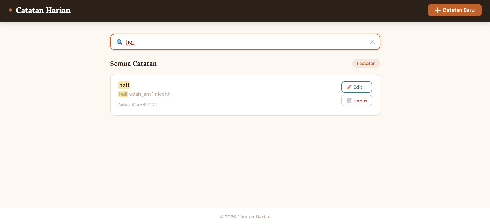

# APLIKASI CATATAN HARIAN SEDERHANA BERBASIS WEB

## NAMA ANGGOTA KELOMPOK
1. Shelly Zumitha Togatorop (1521424023)
2. Mohamad Wisnu Malik Koi (1521424001)
3. Dita Suciani M. Lasibani (1521424012)
4. Sahara Mahmud (1521424011)
5. Nabil T. Husain (1521424020)

## Deskripsi Aplikasi
Aplikasi Catatan Harian Sederhana yang kami buat adalah aplikasi web sederhana untuk menyimpan catatan secara digital. Pengguna bisa menambahkan catatan baru dengan mengisi judul catatan dan isi catatan, lalu catatan tersebut akan tersimpan di browser. 
Aplikasi ini memiliki fitur untuk melihat daftar catatan, membuka detail catatan, mengedit catatan dan menghapus catatan. Selain itu tersedia juga fitur pencarian untuk memudahkan pengguna menemukan catatan berdasarkan judul catatan atau isi catatan.

## FITUR APLIKASI
1. Menambahkan Catatan Baru
2. Menampilkan Detail Catatan
3. Mengedit Isi Catatan
4. Menghapus Catatan
5. Kolom Pencarian Catatan

## Cara Menjalankan Program
1. Buka program menggunakan browser (chrome, microsoft edge, dll).
2. Klik tombol "+ Catatan Baru" di pojok kanan atas
3. Tulis Judul Catatan dan Isi Catatan sesuai dengan keinginan pengguna.
4. Lalu klik "Simpan" untuk menyimpan catatan atau klik "batal" untuk membatalkan.
5. Klik "Edit" untuk mengedit catatan yang diinginkan
6. Lalu klik "Simpan Perubahan" untuk menyimpan perubahan atau klik "batal" untuk membatalkan.
7. Klik "Hapus" untuk menghapus catatan yang diinginkan. Saat klik hapus akan muncul konfirmasi. Klik "OK" untuk melanjutkan atau klik "batal" untuk membatalkan.
8. Jika ingin melihat detail catatan, klik satu kali pada card catatan yang diinginkan. klik "Tutup" untuk menutup detail catatan.
9. Klik kolom pencarian jika ingin mencari catatan yang diinginkan.

## SCREENSHOT APLIKASI

### Tampilan Aplikasi
Berikut adalah tampilan halaman utama aplikasi catatan harian sederhana

### Detail Catatan
Berikut adalah halaman yang akan tampil jika kita ingin melihat detail isi catatan.

### Edit Catatan
Berikut adalah halaman untuk mengedit catatan yang sudah ada.

### Hapus Catatan
Berikut adalah halaman konfirmasi setelah kita klik tombol "hapus".

### Pencarian
Berikut adalah kolom pencarian untuk mencari catatan yang diinginkan.
